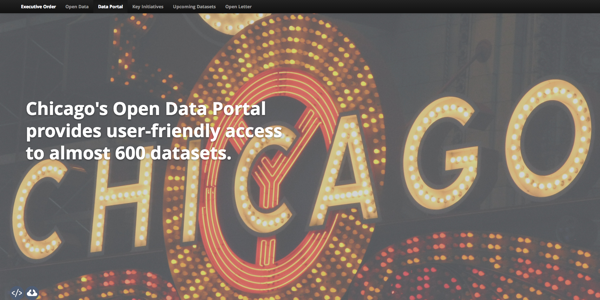

Chicago Open Data Annual Report 2013
------------------------------------

Chicago's inaugural [open data annual report](http://report.cityofchicago.org/open-data-2013/), published in 2013.

The website that powers this report is a fork of @codeforamerica [Annual Report](http://github.com/codeforamerica/annual). Open Source helped make this possible.

Install
-------

This site is build using [jekyll](http://jekyllrb.com/), a static website generator. 

Jekyll is written in Ruby, so you'll need to install Ruby and download the jekyll gem in order to run the report locally.

    sudo gem install jekyll

Run
---
The following command will let you view the site on your local machine:

    jekyll serve

Build
-----
Want to generate all the static files that make up the site, for upload to a web server? Just type:

     jekyll build

Image Credits
-------------
Several images were used with Creative Commons licensing. We would like to thank and acknowledge the use of following images:
+ Dave Sizer, [Around Chicago](http://www.flickr.com/photos/aphid00/5917233995/)
+ Mike Warot, [Chicago Theatre](http://www.flickr.com/photos/pagedooley/2718941649)
+ Avery Studio, [Chicago Public Library 2](http://www.flickr.com/photos/juggernautco/9056237679/in/set-72157634153095271)
+ Daniel X. O'Neil, [Full House at the Chicago Community Trust for the OpenGovChicago Meetup, June 2013](http://www.flickr.com/photos/juggernautco/9056237679/in/set-72157634153095271)
+ Torkild Retvedt, [Server room at CERN](http://www.flickr.com/photos/juggernautco/9056237679/in/set-72157634153095271)
+ Icons from [elegant themes](http://www.elegantthemes.com/blog/freebie-of-the-week/beautiful-flat-icons-for-free) were used in this report. They are licensed under [GPLv2](http://www.gnu.org/licenses/gpl-2.0.html).